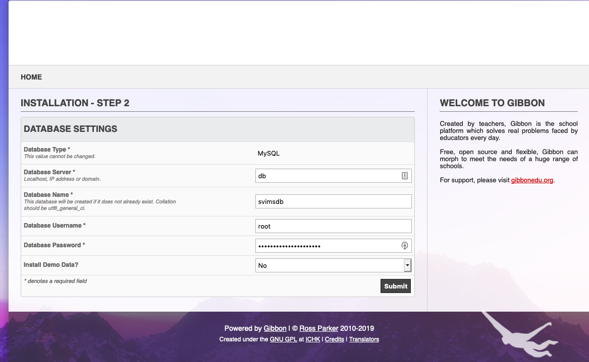
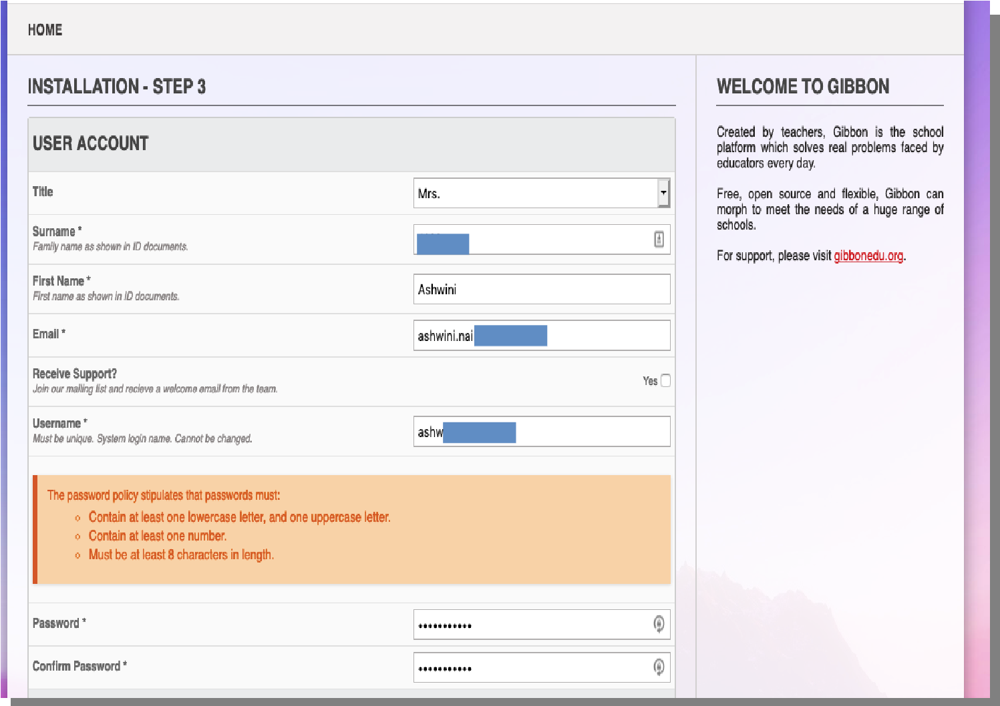
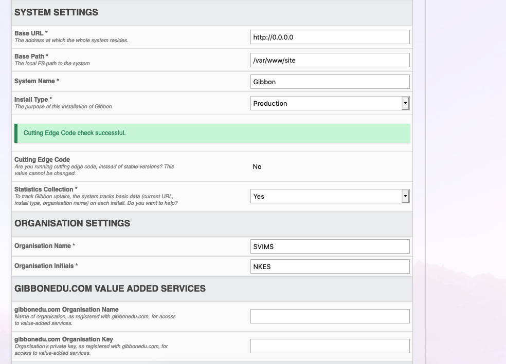
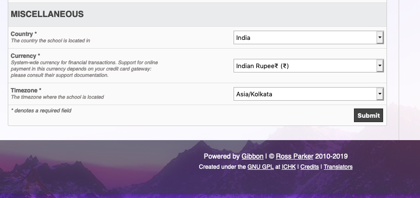

Setup Instructions


1. Install docker & docker-compose [link](https://computingforgeeks.com/install-docker-and-docker-compose-on-debian-10-buster/)
2. Run the following commands in bash shell (Linux) or Powershell/command prompt on(Windows)
   1. Build image 
        ```bash
        docker-compose build
        ```
    2. Run docker image
        ```bash
        docker-compose up -d
        ```
    3. To check status of docker containers
        ```bash
        docker-compose ps
        ```
3. Visit http://0.0.0.0 (on Server machine) or http://\<ipaddress-of-server> (on Client machine)
4. Follow install instructions


*Note: Change the root password in docker-compose.yml file.*

5. Once setup is complete visit repeat step 3
6. Follow setup instructions in the LMS screen
   1. 
   2. 
   3. 
7. Login with your newly created user account
8. Read [Gibbon user manual](https://docs.gibbonedu.org/administrators/getting-started/getting-started-with-gibbon/) for further customization
